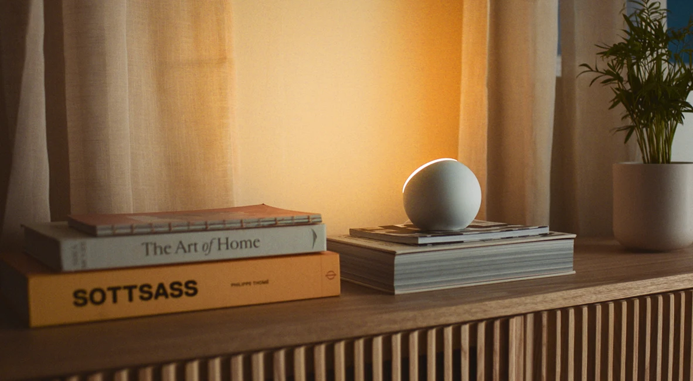

# Oasis Lights for Mac

An unofficial, open-source macOS controller and Home Assistant bridge for
Oasis Ambient 2 lights.

**[Explore the field guide](https://malpern.github.io/oasis-lights-mac/)** ·
**[Download the latest Mac app](https://github.com/malpern/oasis-lights-mac/releases/latest)** ·
**[Read the protocol map](Research/OASIS_DEVICE_SOFTWARE_MAP.md)**

[](https://heyoasis.com/en/shop/ambients)

*Official product photography from the [Oasis Ambients page](https://heyoasis.com/en/shop/ambients), reproduced for product identification and provenance. Oasis retains ownership of its photography and trademarks.*

## What this project does

- Controls two validated Oasis Ambient 2 lights over their existing Bluetooth
  Mesh network without resetting or re-pairing them.
- Provides a native SwiftUI controller for power, brightness, the six official
  Oasis white presets, three colorful presets, and fully custom RGB.
- Keeps Bluetooth and Mesh credentials in a separate headless bridge on the Mac
  mini while controller apps remain removable and on demand.
- Gives Home Assistant the same narrow semantic command surface as the Mac app.
- Documents the confirmed vendor commands, RainMaker model, Light Cycle
  automation schema, effects boundary, and remaining unknowns.

The official Oasis app remains usable. This project is designed as a compatible
client, not a replacement account model.

## Project layout

| Path | Purpose |
| --- | --- |
| `Sources/OasisBridge` | UI-less Bluetooth Mesh bridge and loopback API |
| `Sources/OasisController` | Native macOS controller with Sparkle updates |
| `HomeAssistant/oasis_mesh` | Local Home Assistant custom integration |
| `Research/` | Redacted protocol helpers, regression tests, and field notes |
| `site/` | Public GitHub Pages field guide |
| `Scripts/` | Developer ID build, notarization, install, and bridge deployment |

## Validated controls

The decoded command surface supports individual and group power, brightness,
white temperature, and RGB color. Oasis Lights presents the six official
2000–4000 K whites, adds Coral, Sky, and Violet, and includes an explicit-apply
system color picker.

Displayed state is currently optimistic. The nearby Android client does not
decode ordinary incoming power, brightness, temperature, or color reports, and
this project has not yet established another authoritative readback path.

## Architecture

`Oasis Bridge.app` is a UI-less login agent on the Mac that owns Bluetooth,
Mesh encryption, and replay-safe sequence allocation. It binds its semantic API
to loopback only. Its accessory activation policy gives CoreBluetooth the GUI
session it requires without placing the bridge in the Dock, menu bar, or app
switcher.

`Oasis Lights.app` is an on-demand SwiftUI controller. It terminates when its
last window closes and is the only Sparkle-updated component. The bridge has a
separate deployment lifecycle so removing a UI client cannot accidentally take
Home Assistant offline.

This first public release is optimized for the validated two-light room. Setup
generalization for additional rooms and Oasis products is welcome; do not copy
another installation's Mesh topology or credentials.

## Build and test

Build both apps with the stable Xcode toolchain:

```sh
Scripts/build-apps.sh
```

Use an ad-hoc signature for local source builds without a Developer ID identity:

```sh
OASIS_SIGNING_IDENTITY=- Scripts/build-apps.sh
```

Run the protocol regression suite:

```sh
python3 -m unittest discover -s Research -p 'test_*.py'
```

The build generates each app's `.icns` from the original masters in
`Assets/Generated`. `Oasis Lights.app` embeds Sparkle 2.9.4 and checks the signed
feed at `https://malpern.github.io/oasis-lights-mac/appcast.xml`. The bridge is
never included in that update feed.

## Research and safety boundary

The interoperability notes correlate Oasis Android 2.7.0 with protected,
redacted observations from Oasis iOS 2.7.1 and the validated Ambient 2 lights.
Credential values, private identifiers, vendor binaries, extracted vendor
source, Matter codes, and Mesh keys are deliberately excluded.

Factory reset, provisioning, deprovisioning, room changes, and Matter
commissioning are also excluded from the bridge API. See [NOTICE.md](NOTICE.md)
and [CONTRIBUTING.md](CONTRIBUTING.md) before extending the protocol surface.

## License

MIT. Oasis Lights for Mac is independent and is not affiliated with or endorsed
by Oasis or Mixtiles. Product names, official photography, and trademarks belong
to their respective owners.
